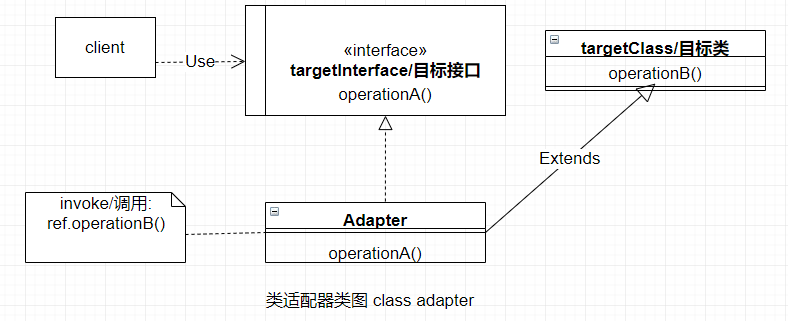
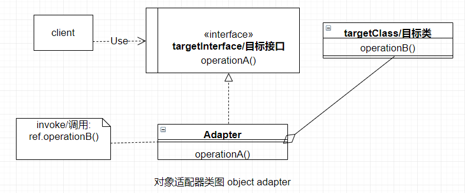

# :nut_and_bolt:适配器模式-Adapter

把一个"错误"的接口:arrows_counterclockwise: ***转换*** 为希望的形式。它处理的是:couple: ***匹配*** 问题。

## :zap: 类图

适配器模式中，建造一个适配器有两种可能性：
  * :zap: 基于 ***类*** 的适配器（简称类适配器）;
  * :elephant: 基于 ***对象*** 的适配器（简称对象适配器）;

### :zap:类适配器

适配器的类实现调用 ***接口*** targetInterface, 并把对适配器的调用 ***委托***给它所继承的对象targetClass.

### :boy:参与者

下面列出适配器模式的参与者：
  * targetClass (需要被匹配的类). 类 targetClass 通过接口的方式operationB()对外提供操作,但是这些接口并不与客户所要求的operationA()匹配,
  所以客户不能直接调用这个类
  * client (客户).客户想使用 targetClass 类, 但是由于自身的需求,客户并不具备使用这个类的接口.
  * targetInterface (目标接口). 这个接口能够满足客户的需求,而且必须被实现.因为这个接口与 targetClass 类的接口不匹配,所以需要一个适配器.
  * Adapter (适配器).以客户client要求的接口形式 operationA() 去调整 targetClass 类的接口 operationB().通过适配器 Adapter 类可以使client和targetClass对象进行通信. 

### :elephant:对象适配器

对象适配器会:poultry_leg: ***"瘦"*** 一些,其它同类适配器基本相同, 类适配器中Adapter完全继承targetClass(目标类)的属性和方法, 而对象适配器只引入 属性.就不做介绍了.

## :sunglasses:评价

### :+1:优点

适配器有下列优点:
  * :no_entry_sign:可以在 ***不相关*** 的软件组件间进行信息交换.
  * :heavy_plus_sign:可以 ***扩展*** 功能
  * :pray:可以调整和 ***优化***

### :-1:缺点

适配器有以下缺点:
  * :clock10:复杂的适配器会导致 ***时间*** 的延误
  * :recycle:适配器可以根据解决方案单独调整,这会导致 ***复用性*** 降低

