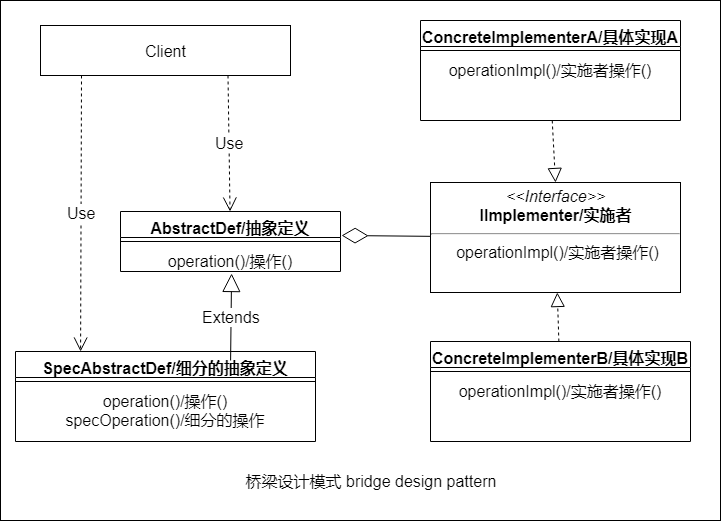

# :bridge_at_night:桥梁模式-Bridge

:dolls:桥梁模式的目的就是要实现 ***抽象定义*** 和它的 ***实现*** 部分可以互不 ***依赖***,单独开发

:scissors:抽象定义和实现的部分相互 ***分隔***,各自只在自己的类的层次结构中.

## :zap:类图

抽象定义和它的实现之间的 ***关系*** 称作 :bridge_at_night:***桥梁***,它在二者之间建立连接

## :boy:参与者

桥梁模式的参与者如下:
  * :bust_in_silhouette: Client (客户).
  * :elephant: AbstractDef (抽象定义). 类 AbstractDef 定义了客户可以使用的 :electric_plug:***接口***,含有指向由自己规定的接口的IImplementer的引用.
  * SpecAbstractDef (细分的抽象定义).这个类是AbstractDef的派生类,可以扩展基类的接口.
  * :electric_plug: IImplementer (实施者).接口 IImplementer 定义了需要实现的接口.必须满足类AbstractDef中方法的需要.
  * :star: ConcreteImplementerA (具体实现A).接口IImplementer中定义的每一种情况都要被实现,这个任务由ConcreteImplementerA完成.

## :sunglasses:评价

### :+1:优点

桥梁模式有下列优点:
  * :dolls:抽象定义(AbstractDef) 和具体实现 (ConcreteImplementerA)通过抽象定义规定的接口 (IImplementer)连接,使抽象定义可以 ***不依赖*** 于具体实现 (依赖倒置)
  * :heavy_plus_sign: 新的抽象定义和新的实现可以简单的 ***加入*** 系统中.
  * :mask:具体实现对于客户是 ***隐藏***的,具体实现可以在运行时替换.
### :-1:缺点
  * :eyeglasses:桥梁模式有的类参与转化,不利于结构的 ***清晰***. 

