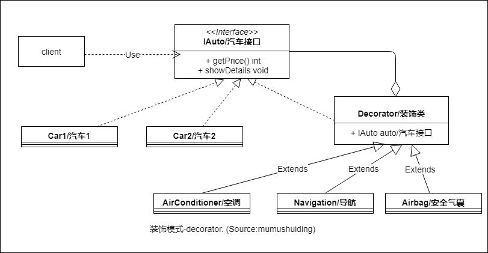

# :christmas_tree: 装饰模式-Decorator

## :question: 问题 

:christmas_tree: 装饰模式应该可以在运行时 ***动态*** 地给一个已有的对象 ***添加*** 功能 (类似装饰圣诞树)

## :heavy_check_mark: 解决方法

  * 1) :dart:通过装饰类 ***聚集*** 需要装饰和扩展的对象.
  * 2) :lipstick:同时提供给顾客或客户与 ***装饰*** 相同的接口.

## :zap:类图

## :boy:参与者

装饰模式的参与者:
  * :baby_chick: IAuto (组件接口).IAuto ***基类***,基类的对象希望扩展自己的功能,但是自身不做任何修改.
  * :lipstick: Decorator (装饰类).  ***装饰*** 类是基类IAuto的派生类, 类 Decorator ***聚集*** 了类 IAuto 接口,通过这个对象可以调用 IAuto 类的子类.装饰类 ***覆写***  所有继承的方法,把调用委托给聚集的对象.
  * :car: Car1/汽车1 (具体实现组件1).是类 IAuto 的子类.
  * :snowflake: AirConditioner/空调 (具体实现装饰类1).是Decorator的实现
## :sunglasses:评价

### :+1:优点

装饰模式具有下列优点:
  * 组件并不识别装饰类
  * :heavy_plus_sign: 可以动态地 ***扩展*** 功能
  * :family: 装饰模式可以把一个 ***继承*** 的层次关系结构中的多个类同时通过一个装饰类进行扩展.
  * :pig: 装饰类可以自由 ***组合***.
### :-1:缺点

装饰模式存在下列缺点:
  * :clock1: 装饰类的主要部分是代理方法,但是代理可导致 ***延时***.
  * :x: 很难找到装饰类的组合应用中发生的 ***错误***.