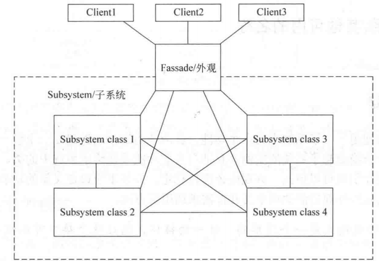
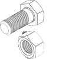

# 外观模式-Facade

## :question: 问题 
外观模式是一个 ***简单*** 的、***统一*** 的接口，通过这个接口可以使用系统中的类。就好像 ***路由器*** 和网关一样，它对外只提供简单的接口，隐藏内部复杂的相互关系。
## :heavy_check_mark: 解决方法
外观 :mask: ***隐藏*** 子系统内部结构的细节，提供一个简单并统一的 ***接口*** 对子系统中的类进行调用，
## :zap:类图

## :boy:参与者

## :sunglasses:评价

### :+1:优点
外观模式有下列优点：
  * 功能更:simple_smile: ***简单*** 了。
  * 子系统同客户类之间是 ***松耦合*** 的。
### :-1:缺点
外观模式有下列缺点：
  * 在调用时增加了一个附加的方法调用，对于简单的子系统，这增加了额外的:fearful: ***负担***。