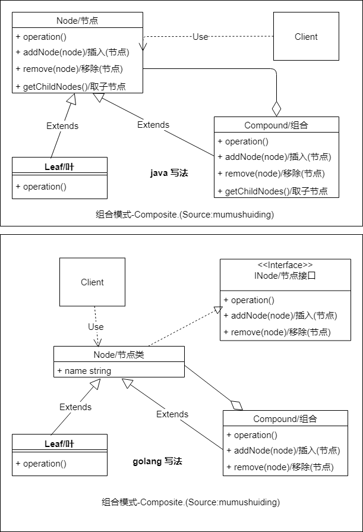

# :herb: 组合模式-Composite
组合模式就像是一个:palm_tree: ***树形***结构,基本单位是:leaves: ***叶*** 对象，基本节点互相聚集在一起就是:herb: ***组合*** 对象
## :question: 问题 
客户只需要知道节点的抽象的  ***接口***，树形结构中的节点在工作时无论是单一还是组合的都会同样处理
## :heavy_check_mark: 解决方法
组合模式的基础是定义一个抽象类 Node,通过 ***接口*** 和契约确定它的行为.:leaves:叶类Leaf是Node的派生类,:no_entry_sign: ***不能*** 聚集节点. ***组合*** 对象Compoud是Node的派生类,可以:dart: ***聚集*** 多个Node节点.
## :zap:类图

## :boy:参与者

组合模式的参与者如下：
  * Node (节点).抽象类Node确定了派生类的接口和行为.
  * :leaves: Leaf (叶).体现了树形结构中的一个终结元素.
  * :herb: Compound (组合).它可以聚集其他节点.
## :sunglasses:评价

### :+1:优点

优点:
  * 叶和组合具有相同的接口,客户可以 ***统一*** 处理
  * 可以多层 ***嵌套***

### :-1:缺点
缺点:
  * 过多地使用不同的叶类和组合类,设计和构造树形结构就会条理不清.