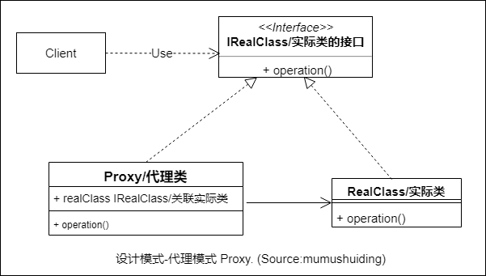
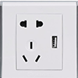

# 代理模式-Proxy

## :question: 问题 

代理模式是把一个实际存在的对象 ***隐藏*** 在一个与它有相同 ***接口*** 的代理者身后。

## :heavy_check_mark: 解决方法

代理者 ***包含*** 实际对象的接口，通过实际对象要经过代理

## :zap:类图

## :boy:参与者

  * IRealClass（实际类的 ***接口*** ）。确定了实际类中的方法的定义。
  * RealClass（ ***实际*** 类）。实现了IRealClass中的方法
  * Proxy（ ***代理*** ）。实现了IRealClass中的方法，并有指向实际类的 ***引用*** 。

## :sunglasses:评价

### :+1:优点

  * :heavy_plus_sign: 可以通过代理 ***扩展*** 已有应用
  * 可以 ***附加*** 实现实际对象不需要的操作

### :-1:缺点

  * :beetle: 增加代理 ***查错*** 困难
  * :arrow_down: ***降低*** 性能