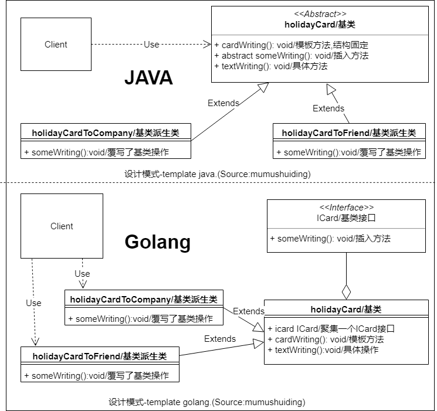

# 模板方法模式-TemplateMethod

## :question: 问题 

算法的基本 ***结构*** 应该在基类中确定，在子类中实现 ***可变化*** 部分

## :heavy_check_mark: 解决方法

模板方法模式用于 ***可分解*** 成单个操作的算法，算法由:elephant: ***抽象*** 的单个操作和产 ***具体*** 的单个操作组成，算法的结构已经在模板中:anchor: ***固定*** 。抽象的单个操作作为 ***插入*** 方法放入模板方法中，插入方法由子类实现。

## :zap:类图

## :boy:参与者
  * ICard (基类接口).定义了基类的可变方法，并由派生类覆写
  * :chicken: holidayCard (基类). 基类定义了模板方法和具体操作
  * holidayCardToCompany (基类派生类). 覆写了基类的可变操作。
## :sunglasses:评价

### :+1:优点
  * :couplekiss: 实现了 ***依赖倒置***
  * :recycle: 模板保证了高度的 ***复用*** 性。

### :-1:缺点
  * 无