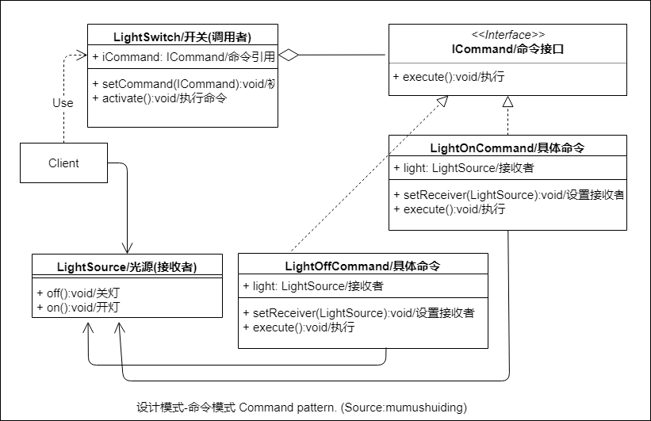

# 命令模式-Command

## :question: 问题 

命令模式可以把一个命令的 ***形成*** 和 ***执行*** 在时间上去耦。也就是命令生成和执行可以在不同的时间发生。

## :heavy_check_mark: 解决方法

一个 ***具体*** 命令（execute()/执行）和指向 ***接收*** 对象（LightSource）的引用被 ***封装*** 在一个 ***基于*** 接口（ICommand）的对象（LightOffCommand）中，这个对象被交给调用者（LightSwitch）。调用者从客户得到命令，然后 ***初始化*** 用于执行命令的方法。

## :zap:类图

## :boy:参与者
  * ICommand（命令接口）。定义了命令操作
  * LightOffCommand（具体命令）。实现了命令接口ICommand，***封装*** 了一个命令， ***存储*** 了执行这个命令所需的信息。
  * LightSwitch （调用者）。:floppy_disk: ***存储*** 了指向一个命令的引用，引用的类型是ICommand。
  * :bulb:LightSource （接收者）。 ***识别*** 所有执行命令相关操作的类。
## :sunglasses:评价

### :+1:优点
  * :nut_and_bolt:生成和执行在时间上 ***解耦***
  * 具体命令可以动态 ***更换***
  * :recycle:命令对象可以 ***复用***

### :-1:缺点
  * 这个模式用于分布式系统时相当复杂
  * 调用命令时会生成额外开销