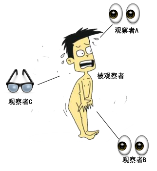
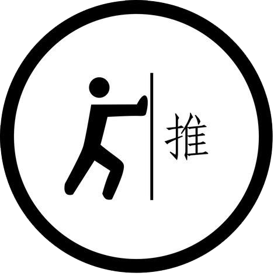
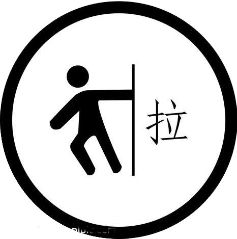
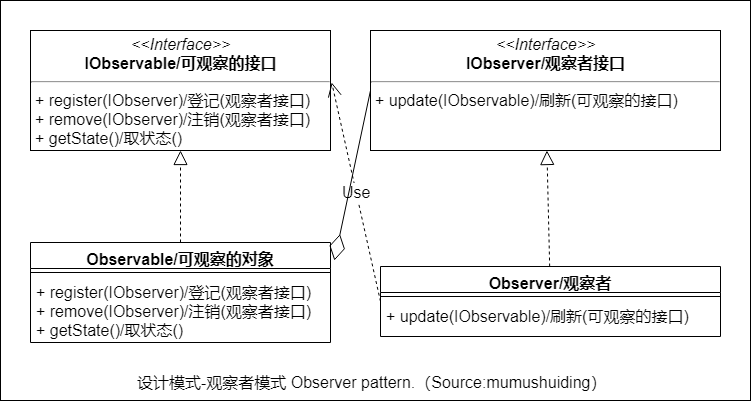

# :eyes:观察者模式-Observer

## :question: 问题 
采用观察者模式，当一个对象的状态发生 ***变化*** 时，它会:loudspeaker: ***通知*** 所有依赖它的对象。
## :heavy_check_mark: 解决方法
一个:dart: ***可观察*** 对象可以被多个:eyes: ***观察者*** 对象监督。可观察对象在运行时:memo: ***登记*** 观察者，当它状态发生变化时，都会:loudspeaker: ***通知*** 所有的观察者。

观察者模式使用两种方法把最新的状态发送给观察者：
  * 1）把新的状态 ***推送*** 给观察者
  * 2）观察者自己去 ***拉取*** 数据
## :zap:类图

## :boy:参与者
  * IObservable （可观察的接口）。接口中含有对观察者的:memo: ***登记*** 和:x: ***注销*** 以及抽象方法取状态。
  * IObserver （观察者接口）。是可观察类（Observable）的回调接口。接口由一个观察者实现
  * :dart: Observable （可观察类）。包含指向观察类对象的引用列表。
  * :eyes: Observer （观察者类）。
## :sunglasses:评价

### :+1:优点
  * 观察者可以动态添加和删除
  * 可观察类和观察者 ***互不依赖***

### :-1:缺点
  * 观察者过多时，发布消息需要消耗过多时间