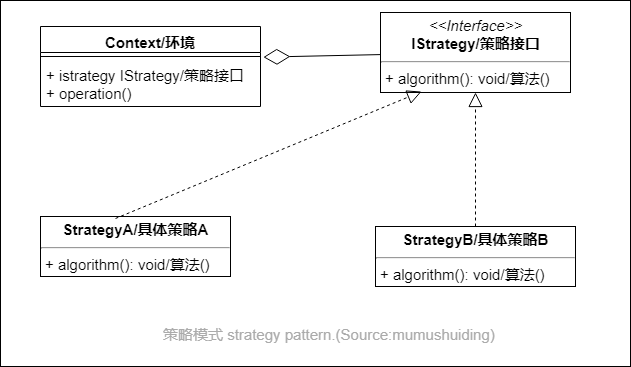

# 策略模式-Strategy

## :question: 问题 

为了把一组不同的 ***算法*** 在应用中相互进行替换。

## :heavy_check_mark: 解决方法

策略模式把所有可用的 ***策略*** 通过接口 IStrategy 进行 ***抽象化*** ，并把每一个策略封装在一个对象中。

## :zap:类图

## :boy:参与者
  * Context（环境）。类 Context 聚集了接口IStrategy.
  * IStrategy（策略接口）。所有的算法都实现了这个接口。
  * StrategyX（具体实现策略X）。实现了接口IStrategy。
## :sunglasses:评价
### :+1:优点
  * 一个封装的算法易于 ***复用***。
  * 运行时可以灵活的 ***替换*** 算法。

### :-1:缺点
  * 经常会写很多小的程序