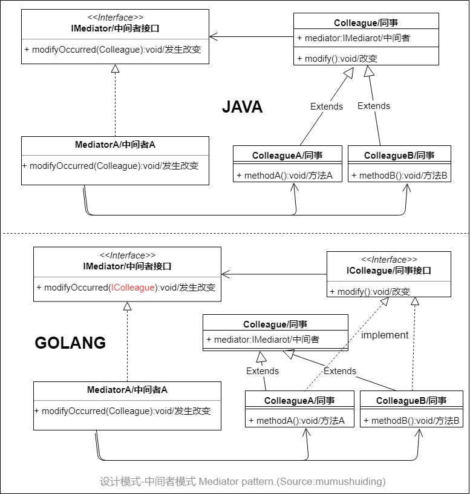

# 中间者模式-Mediator

## :question: 问题 

处在 ***中心位置*** 的中间者应该控制多个对象间的 ***协调*** 工作。对象间的相互合作通过中间者在对象间传递消息实现，以此实现对象间的 ***去耦*** ，提高对象的复用性和系统整体对外的清晰性。

## :heavy_check_mark: 解决方法

在中间者模式，对象间不是直接互相通信，而是 ***间接*** 地通过中间者。中间者收到消息后，再通知所有相关的对象。

## :zap:类图

## :boy:参与者
  * Mediator （中间者）。是一个抽象类，它定义了接口。同事对象的更改信息要通过这个接口转给其他对象。
  * ConcreteMediator（具体中间者）。实现一个具体的中间者。具体中间者实现了与具体同事 ***通信*** 的结构，它拥有指向所有同事的 ***引用*** 。如果中间者要要接收一个同事的信息，它可以调用相应的同事中的方法。对具体中间者可以给出多个类，它们可以分别适用于同事对象的每种不同情况和同事对象的相互合作。
  * Colleague （同事）。可以是一个 ***抽象*** 类或者是针对所有具体同事的一个接口。一个同事含有一个指向一个具体 ***中间者*** 的引用。
  * ConcreteColleagueX（具体同事X）. 是类 Colleague的派生类

## :sunglasses:评价

### :+1:优点
  * :nut_and_bolt: 同事对象之间是 ***松耦合*** 的，同事对象是可复用的
  * :scissors: ***简化*** 同事之前的关系。
### :-1:缺点
  * :astonished: 中间者可能很 ***复杂***
  * :x:中间者容易发生 ***错误***
  * 如果同事间 ***关系*** 发生改变，必须调整中间者