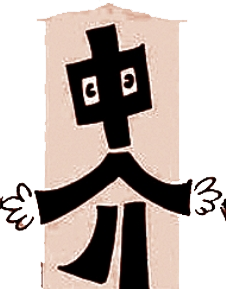

# 设计模式

:house:结构模式主要记录的是类或对象的 ***静态结构***，:family:行为模式描述了通过对象间的合作形成的一种 ***关系***，:factory:创建模式用于 ***生成***对象。
#### 目录
  * :house: [结构模式](#结构模式)
    * :nut_and_bolt: <a href="./01_Adapter">适配器模式-Adapter</a>
    * :bridge_at_night:<a href="./02_Bridge">桥梁模式-Bridge</a>
    * :christmas_tree:<a href="./03_Decorator/">装饰模式-Decorator</a>
    * <a href="./04_Facade/">外观模式-Fassade</a>
    * :herb:<a href="./05_Composite/">组合模式-Composite</a>
    * <a href="./06_Proxy/">代理模式-Proxy</a>
  * [行为模式](#行为模式)
    * [模板方法模式-TemplateMethod](#模板方法模式-TemplateMethod)
    * [命令模式-Command](#命令模式-Command)
    * :eyes: [观察者模式-Observer](#观察者模式-Observer)
    * [策略模式-Stragegy](#策略模式-Stragegy)
    * [中间者模式-Mediator](#中间者模式-Mediator)
    * [状态模式-State](#状态模式-State)
    * [角色模式-Role](#角色模式-Role)
    * [访问者模式-Visitor](#访问者模式-Visitor)
    * [迭代器模式-Iterator](#迭代器模式-Iterator)
  * [创建型模式](#创建型模式)
    * [工厂方法-FactoryMethod](#工厂方法-FactoryMethod)
    * [抽象工厂-AbstractFactory](#抽象工厂-AbstractFactory)
    * [单例模式-Singleton](#单例模式-Singleton)
    * [对象池模式-Pool](#对象池模式-Pool)

## 结构模式

## 行为模式

### 模板方法模式-TemplateMethod

### 命令模式-Command

### 观察者模式-Observer

### 策略模式-Stragegy

### 中间者模式-Mediator

### 状态模式-State

### 角色模式-Role

### 访问者模式-Visitor

### 迭代器模式-Iterator

## 创建型模式

### 工厂方法-FactoryMethod

### 抽象工厂-AbstractFactory

### 单例模式-Singleton

### 对象池模式-Pool